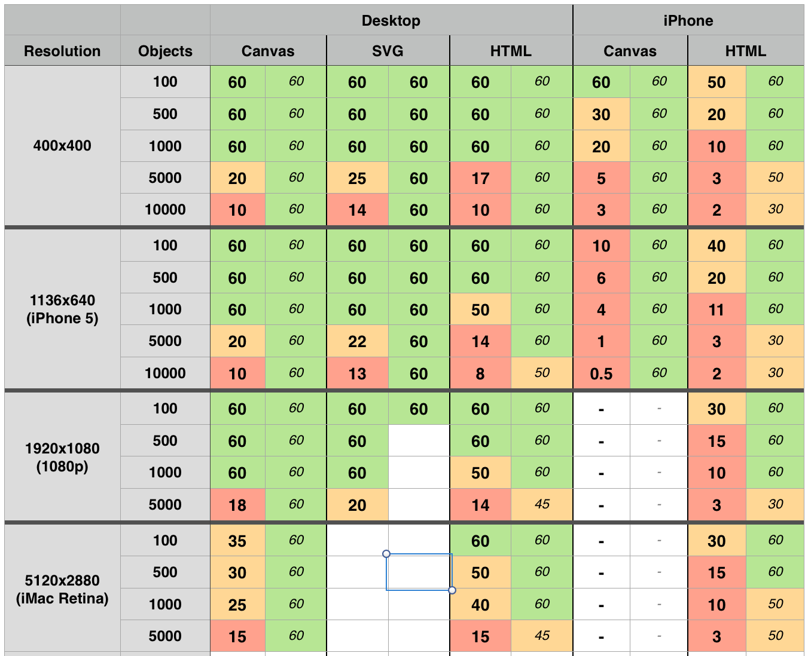

# HTML vs Canvas

Testing the differences between HTML and Canvas when rendering multiple moving objects.

These results show two values for each test: Moving objects, and stationary objects. In both cases the test still iterates over all the objects each frame, it just doesn't move any of them.

